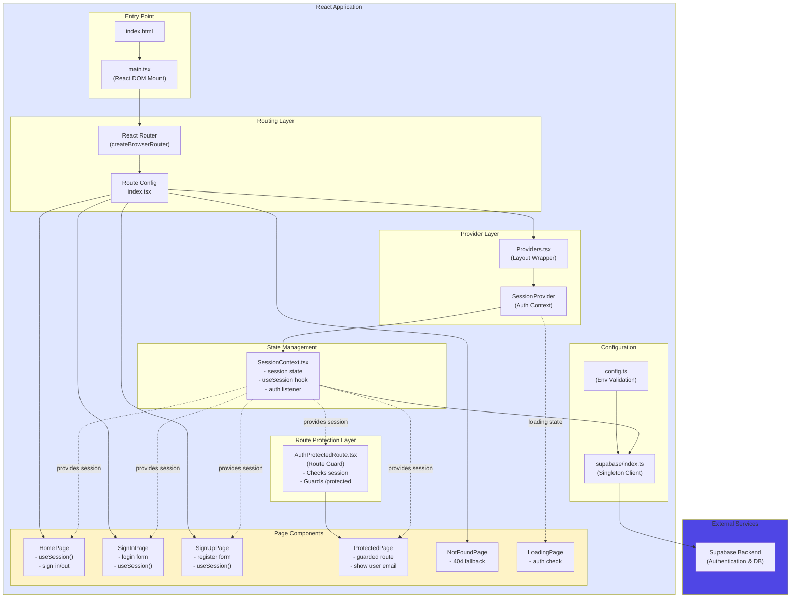
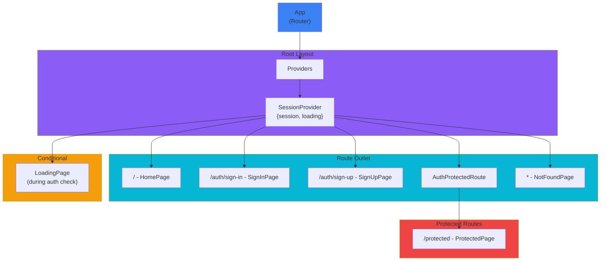
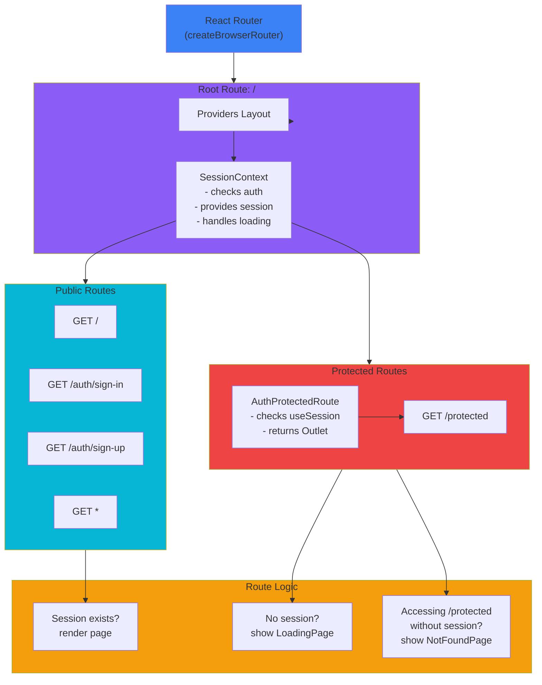
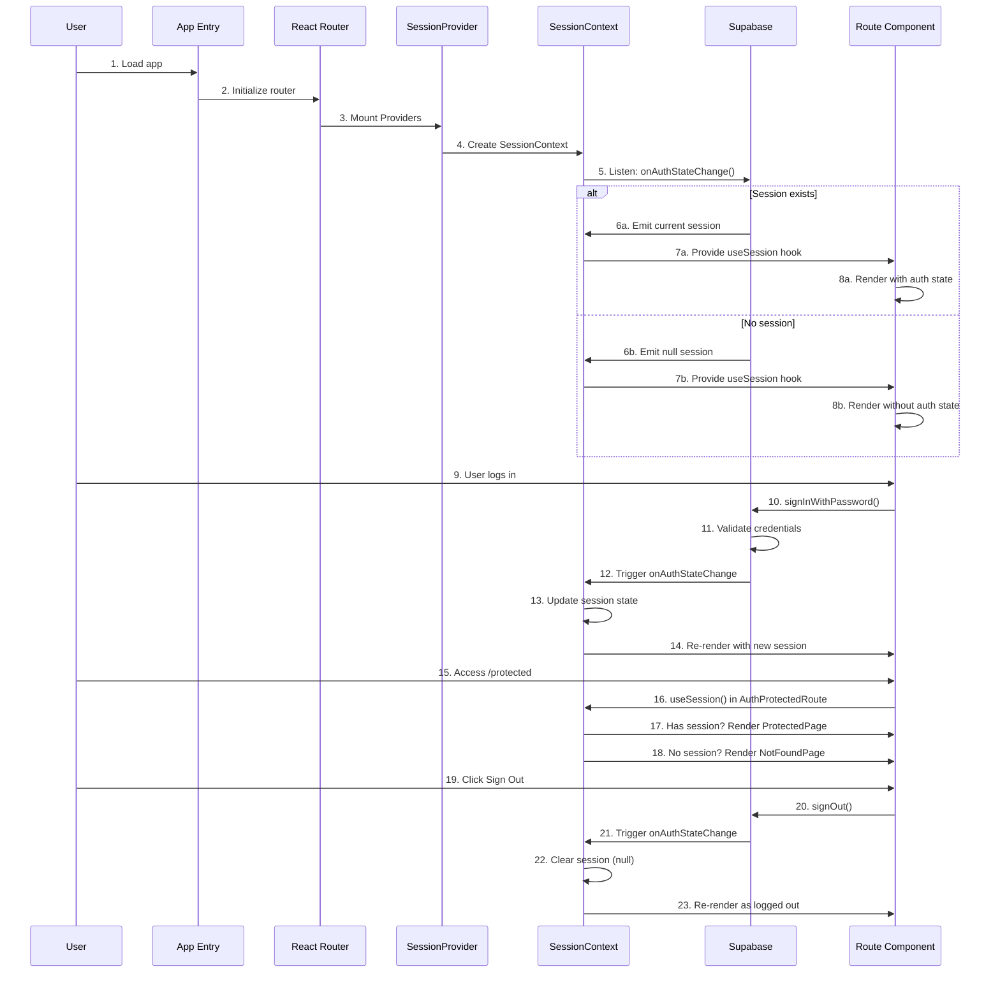
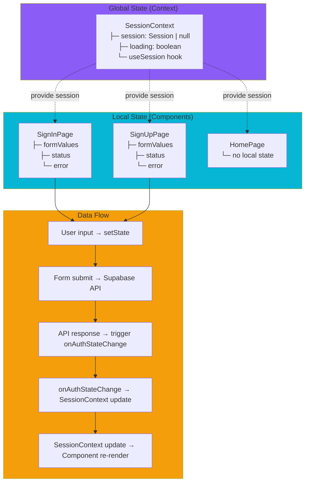
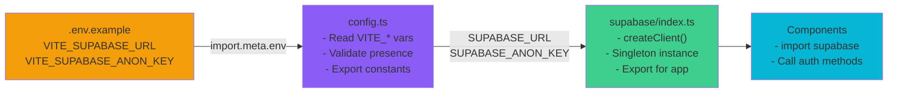
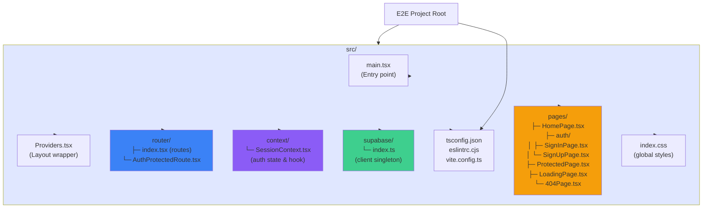

# React Supabase Auth Template - Architecture Visualization

## High-Level Architecture



---

## Component Hierarchy & Tree Structure



---

## Authentication Data Flow

```mermaid
graph LR
    subgraph User["User Interaction"]
        A["User visits app"]
        B["User logs in/signs up"]
        C["User accesses /protected"]
        D["User logs out"]
    end

    subgraph SupaAuth["Supabase Auth"]
        S1["onAuthStateChange<br/>listener active"]
        S2["signInWithPassword"]
        S3["signUp"]
        S4["signOut"]
    end

    subgraph Context["SessionContext"]
        C1["Loading state = true"]
        C2["session updated<br/>session = Session obj"]
        C3["session = null"]
    end

    subgraph Components["Components"]
        Comp1["SessionProvider<br/>checks auth"]
        Comp2["HomePage/SignIn/SignUp<br/>display UI"]
        Comp3["AuthProtectedRoute<br/>checks session"]
        Comp4["ProtectedPage<br/>renders if session"]
        Comp5["NotFoundPage<br/>renders if !session"]
    end

    A --> C1
    C1 --> Comp1
    Comp1 --> Comp2

    B --> S2 & S3
    S2 --> S1
    S3 --> S1
    S1 --> C2

    C2 --> Comp2
    C2 --> C --> Comp3
    Comp3 --> Comp4 | Comp5

    D --> S4
    S4 --> S1
    S1 --> C3
    C3 --> Comp2

    style SupaAuth fill:#3ecf8e
    style Context fill:#8b5cf6
    style Components fill:#f59e0b
```

---

## Routing Architecture with Auth Integration



---

## Auth Integration Flow with Routing



---

## State Management Architecture



---

## Configuration & Initialization



---

## File Structure & Responsibilities



---

## Summary

This React Supabase Auth Template demonstrates a **clean, modern architecture** with:

- **Layered Architecture**: Separation of routing, state management, UI
- **Authentication-First Design**: Session context drives app behavior
- **Type-Safe**: Full TypeScript implementation
- **Protected Routes**: Auth-aware routing with AuthProtectedRoute
- **Context-Based State**: Minimal, effective state management
- **Modular Organization**: Clear file structure and responsibilities
- **Supabase Integration**: Backend-agnostic auth through SDK

The key innovation is how authentication seamlessly integrates with React Router through the SessionContext provider pattern, enabling declarative route protection and automatic auth-based UI rendering.
