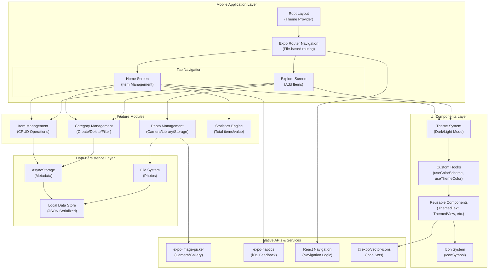
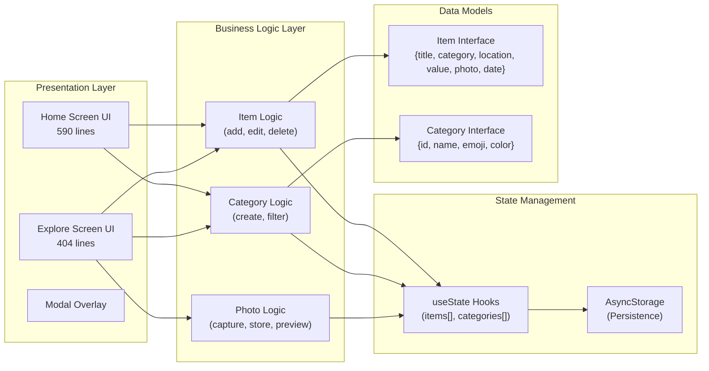
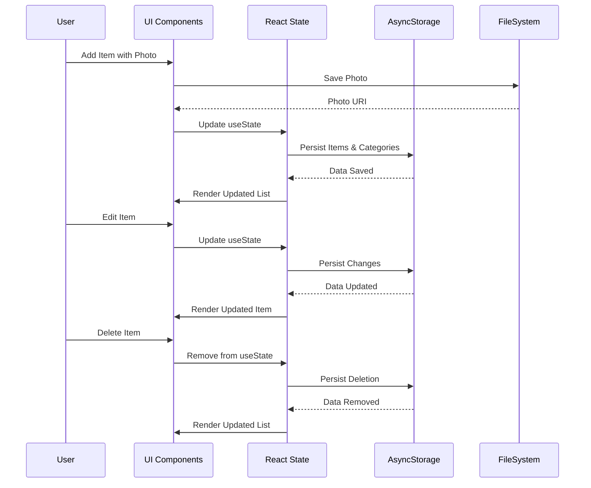
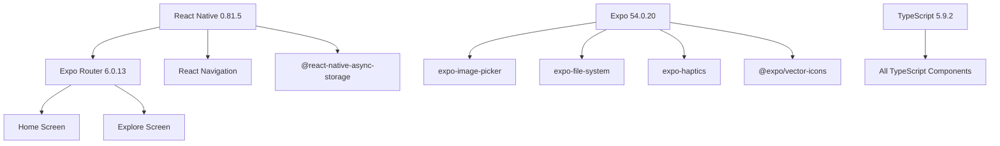

# StashSnap Architecture Diagram

## High-Level Architecture Overview

---

## Detailed Component Architecture

---

## Data Flow Architecture

---

## Technology Stack & Dependencies

---

## Key Features & Modules

```mermaid
graph TB
    StashSnap["StashSnap App"]

    StashSnap --> Feature1["Item Management"]
    Feature1 --> F1A["Create Items"]
    Feature1 --> F1B["Edit Items"]
    Feature1 --> F1C["Delete Items"]
    Feature1 --> F1D["View Items"]

    StashSnap --> Feature2["Category System"]
    Feature2 --> F2A["Create Categories"]
    Feature2 --> F2B["Delete Categories"]
    Feature2 --> F2C["Filter by Category"]
    Feature2 --> F2D["Category Stats"]

    StashSnap --> Feature3["Photo Management"]
    Feature3 --> F3A["Camera Capture"]
    Feature3 --> F3B["Gallery Selection"]
    Feature3 --> F3C["Photo Preview"]
    Feature3 --> F3D["Photo Persistence"]

    StashSnap --> Feature4["Data Persistence"]
    Feature4 --> F4A["AsyncStorage"]
    Feature4 --> F4B["File System"]
    Feature4 --> F4C["JSON Serialization"]

    StashSnap --> Feature5["Theme & UI"]
    Feature5 --> F5A["Dark Mode"]
    Feature5 --> F5B["Light Mode"]
    Feature5 --> F5C["Auto Theme Detection"]
    Feature5 --> F5D["Platform Optimization"]
```

---

## Architecture Summary

**Type:** React Native Mobile Application
**Pattern:** Component-Based Architecture with File-Based Routing
**State Management:** React Hooks + AsyncStorage
**Data Persistence:** Local-First (No Backend)
**UI Framework:** Expo with Themed Components
**Platform Support:** iOS & Android (via Expo)

**Core Characteristics:**
- ✅ Modular component structure
- ✅ Clear separation of concerns
- ✅ Platform-specific optimizations
- ✅ Dark/Light theme support
- ✅ Photo storage capability
- ✅ Category-based organization
- ✅ Offline-first functionality
