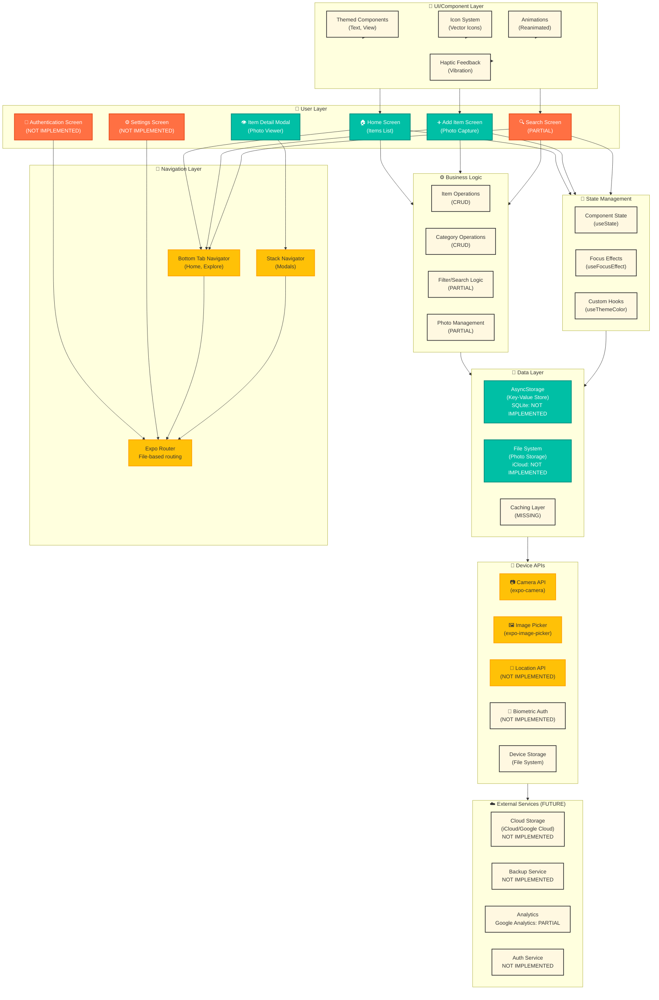
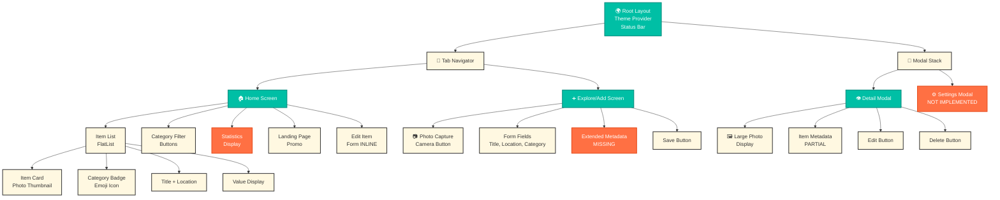
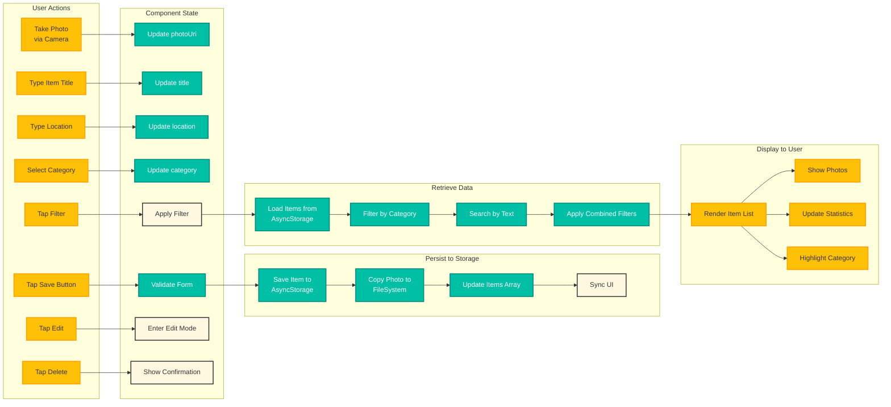
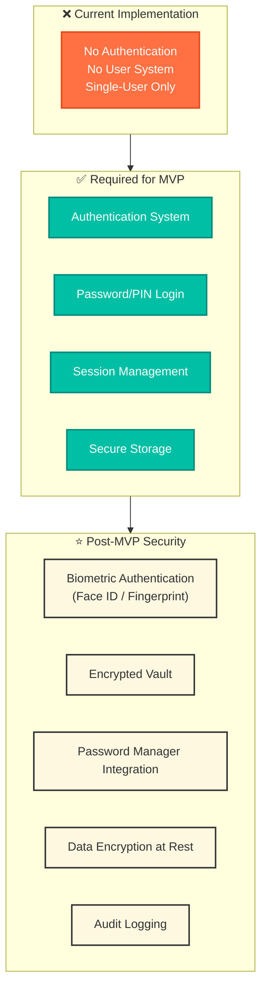
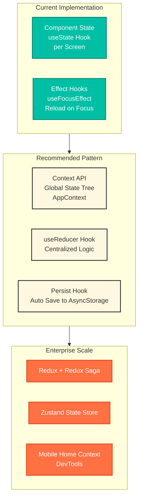
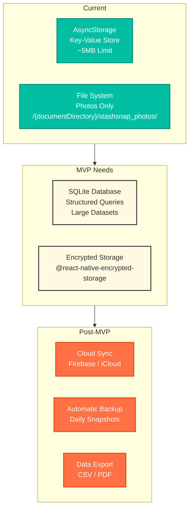
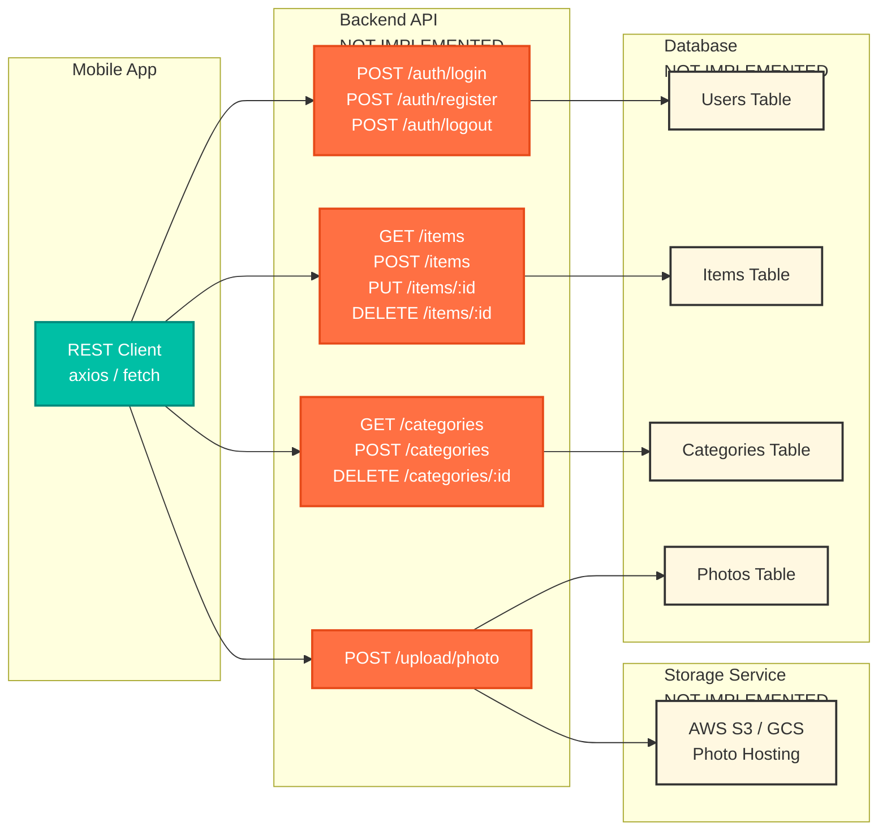

# StashSnap - Complete Mobile Application Architecture

## Executive Summary

**Current Status**: MVP Phase 2-3 (Store & Find items partially working)
**Missing Components**: Phase 0 (Auth), Advanced metadata, Settings, Trash system, Cloud sync
**Architecture Style**: Single-user, offline-first, client-side only

---

## Architecture Overview Diagram



---

## Component Hierarchy



---

## Data Flow Architecture



---

## File Structure for Mobile App

```mermaid
graph TD
    ROOT["📁 stashsnap"]

    ROOT --> APP["📁 app/<br/>(Screens & Navigation)"]
    ROOT --> COMP["📁 components/<br/>(Reusable UI)"]
    ROOT --> CONST["📁 constants/<br/>(Config)"]
    ROOT --> HOOKS["📁 hooks/<br/>(Custom Hooks)"]
    ROOT --> ASSETS["📁 assets/<br/>(Images, Icons)"]
    ROOT --> UTILS["📁 utils/<br/>(Helpers) MISSING"]
    ROOT --> SERVICES["📁 services/<br/>(Business Logic) MISSING"]
    ROOT --> TYPES["📁 types/<br/>(TypeScript) MISSING"]

    APP --> APP_LAYOUT["_layout.tsx<br/>Root + Theme"]
    APP --> TABS["(tabs)/<br/>Bottom Navigation"]
    APP --> MODAL["modal.tsx<br/>Template"]

    TABS --> HOME["index.tsx<br/>Home Screen"]
    TABS --> EXPLORE["explore.tsx<br/>Add Item Screen"]
    TABS --> TABSLAYOUT["_layout.tsx<br/>Tab Config"]

    COMP --> THEMED["themed-text.tsx"]
    COMP --> THEMED_V["themed-view.tsx"]
    COMP --> ICONS["icon-symbol.tsx"]
    COMP --> HAPTIC["haptic-tab.tsx"]
    COMP --> COLLAPSIBLE["collapsible.tsx"]

    CONST --> THEME["theme.ts<br/>Colors & Fonts"]

    HOOKS --> COLORSCHEME["use-color-scheme.ts"]
    HOOKS --> THEMECOLOR["use-theme-color.ts"]

    ASSETS --> IMAGES["images/<br/>App Icons"]

    classDef default fill:#FFF8E1,stroke:#333,stroke-width:2px,color:#333;
    classDef primary fill:#00BFA5,stroke:#00897B,stroke-width:2px,color:#fff;
    classDef secondary fill:#FF7043,stroke:#E64A19,stroke-width:2px,color:#fff;
    classDef missing fill:#BDBDBD,stroke:#757575,stroke-width:2px,color:#fff;

    class ROOT,APP,TABS primary
    class COMP,CONST,HOOKS primary
    class UTILS,SERVICES,TYPES missing
```



---

## Security & Authentication Architecture



---

## State Management Architecture



---

## Storage Architecture



---

## API Integration Architecture (Future)



---

# Functionality Reconciliation: Checklist vs. Implementation

## Phase 0: User Authentication

| Feature | Status | Notes |
|---------|--------|-------|
| **Login Screen** | ❌ MISSING | Entire auth system not implemented |
| **Password Input** | ❌ MISSING | No authentication screens |
| **Session Management** | ❌ MISSING | No user session tracking |
| **Secure Password Storage** | ❌ MISSING | No password hashing or storage |
| **Logout Functionality** | ❌ MISSING | No logout mechanism |
| **Navigation Guards** | ❌ MISSING | No auth-protected routes |

**Severity**: **CRITICAL** - Required before public release

---

## Phase 1: Store an Item

| Feature | Status | Notes |
|---------|--------|-------|
| **Quick Capture Form** | ✅ IMPLEMENTED | Title, Location, Category, Value fields |
| **Photo Capture** | ✅ IMPLEMENTED | Camera + Gallery via ImagePicker |
| **Save to Storage** | ✅ IMPLEMENTED | AsyncStorage + FileSystem |
| **Form Validation** | ✅ IMPLEMENTED | Prevents save with empty title |
| **Instant Feedback** | ✅ IMPLEMENTED | Item appears in list immediately |
| **Description Field** | ❌ MISSING | No description/notes support |
| **Tags System** | ❌ MISSING | No tagging functionality |
| **Notes Field** | ❌ MISSING | No notes/details field |

**Severity**: **HIGH** - Metadata fields critical for search

---

## Phase 2: Find an Item

| Feature | Status | Notes |
|---------|--------|-------|
| **Photo Thumbnails** | ✅ IMPLEMENTED | Photos visible on item cards |
| **Location Text** | ✅ IMPLEMENTED | Location visible on cards and detail |
| **Detail Modal** | ✅ IMPLEMENTED | Shows full item details |
| **Smooth Scrolling** | ✅ IMPLEMENTED | FlatList optimization |
| **Metadata Preview** | ⚠️ PARTIAL | Only shows title, location, category |
| **Description Display** | ❌ MISSING | Description not captured |
| **Tags Display** | ❌ MISSING | Tags not implemented |
| **Notes Display** | ❌ MISSING | Notes not captured |

**Severity**: **MEDIUM** - Basic functionality works, enhanced metadata missing

---

## Phase 3: Search & Filter Items

| Feature | Status | Notes |
|---------|--------|-------|
| **Search Bar** | ❌ MISSING | No search functionality |
| **Search by Text** | ❌ MISSING | No text search |
| **Search by Tags** | ❌ MISSING | Tags system not implemented |
| **Filter by Category** | ✅ IMPLEMENTED | Working category filter |
| **Filter by Location** | ❌ MISSING | No location-based filtering |
| **Date Range Filter** | ❌ MISSING | No date filtering |
| **Combined Filters** | ❌ MISSING | Only single category filter |
| **Filter Reset** | ✅ IMPLEMENTED | Can switch between categories |

**Severity**: **HIGH** - Search essential for usability with many items

---

## Phase 4: Organize Items - Categories

| Feature | Status | Notes |
|---------|--------|-------|
| **Default Categories** | ✅ IMPLEMENTED | Documents, Jewelry, Other |
| **Custom Categories** | ✅ IMPLEMENTED | Can create new categories |
| **Category Icons** | ✅ IMPLEMENTED | Emoji-based icons |
| **Category Colors** | ✅ IMPLEMENTED | Hex colors assigned |
| **Category Badge Display** | ✅ IMPLEMENTED | Visible on item cards |
| **Filter by Category** | ✅ IMPLEMENTED | Category filter working |
| **Category Management** | ✅ IMPLEMENTED | Can add/delete categories |

**Severity**: **COMPLETE** - Phase 4 fully implemented

---

## Phase 5: Polish - Theme & Appearance

| Feature | Status | Notes |
|---------|--------|-------|
| **Dark Mode** | ✅ IMPLEMENTED | Theme detection working |
| **Light Mode** | ✅ IMPLEMENTED | Automatic theme switching |
| **Professional Design** | ⚠️ PARTIAL | Functional but needs polish |
| **Navigation Tabs** | ✅ IMPLEMENTED | Home (house), Explore (plane) |
| **Status Bar Styling** | ✅ IMPLEMENTED | Theme-aware |
| **Visual Hierarchy** | ⚠️ PARTIAL | Could be improved |
| **Font Styling** | ✅ IMPLEMENTED | Platform-specific fonts |
| **Color Scheme** | ✅ IMPLEMENTED | Light/dark color definitions |

**Severity**: **LOW** - Core functionality working, visual polish needed

---

## Phase 6: Edit, Delete & Data Management

| Feature | Status | Notes |
|---------|--------|-------|
| **Edit Items** | ✅ IMPLEMENTED | Inline editing in home screen |
| **Delete Items** | ✅ IMPLEMENTED | With confirmation dialog |
| **Confirmation Dialog** | ✅ IMPLEMENTED | Prevents accidental deletion |
| **Trash/Recovery System** | ❌ MISSING | Deleted items permanently removed |
| **Clear All Items** | ❌ MISSING | No bulk clear functionality |
| **Local Storage Toggle** | ❌ MISSING | No settings screen |
| **Photo Cleanup** | ✅ IMPLEMENTED | Photos removed on delete |
| **Undo Functionality** | ❌ MISSING | No undo system |

**Severity**: **MEDIUM** - Basic editing works, trash system missing

---

## Phase 7: Settings & Preferences

| Feature | Status | Notes |
|---------|--------|-------|
| **Settings Screen** | ❌ MISSING | No settings interface |
| **Storage Options** | ❌ MISSING | No configuration options |
| **Local Storage Toggle** | ❌ MISSING | No save to device library |
| **Cloud Sync Toggle** | ❌ MISSING | No cloud options |
| **Password Change** | ❌ MISSING | No auth system |
| **Profile Management** | ❌ MISSING | Single-user only |
| **Data Export** | ❌ MISSING | No export functionality |
| **Clear All Data** | ❌ MISSING | No data management UI |

**Severity**: **HIGH** - Settings needed for user control

---

## Phase 8: Beta Testing & Validation

| Feature | Status | Notes |
|---------|--------|-------|
| **Beta Testing Framework** | ❌ MISSING | No testing infrastructure |
| **Crash Reporting** | ❌ MISSING | No error tracking |
| **Analytics** | ⚠️ PARTIAL | Google Analytics stub exists |
| **Performance Monitoring** | ❌ MISSING | No performance tracking |
| **User Feedback System** | ❌ MISSING | No in-app feedback |

**Severity**: **MEDIUM** - Nice-to-have for MVP validation

---

# Implementation Summary

## What's Working ✅

1. **Item Management**: Add, view, edit, delete items
2. **Photo Capture**: Camera and gallery integration
3. **Category System**: Create, organize, filter by categories
4. **Local Storage**: AsyncStorage persistence
5. **Theme Support**: Dark/light mode
6. **Navigation**: Bottom tabs, basic routing
7. **UI Components**: Themed components, icons, animations

## What's Missing ❌

### Critical (Must Fix for MVP)
- **Phase 0**: Complete authentication system (login, password, session)
- **Phase 3**: Search and advanced filtering
- **Phase 7**: Settings screen and user preferences

### High Priority (Should Add)
- **Metadata Fields**: Description, tags, notes
- **Trash System**: Deleted items recovery
- **Cloud Sync**: Data backup and sync

### Medium Priority (Post-MVP)
- **UI Polish**: Better visual hierarchy, professional appearance
- **Performance**: Optimize for large datasets
- **Analytics**: Complete analytics implementation

---

## Technology Stack Recommendations

### For Mobile App

**Current Stack** (Good):
- ✅ Expo (cross-platform build)
- ✅ React Native (mobile UI)
- ✅ TypeScript (type safety)
- ✅ AsyncStorage (local data)

**To Add**:
- ⭐ SQLite (structured data)
- ⭐ Realm (encrypted storage)
- ⭐ Redux or Zustand (state management)
- ⭐ React Query (data fetching)
- ⭐ Auth0 or Firebase Auth (authentication)

### For Backend (Future Cloud Sync)

**Recommended Stack**:
- Node.js + Express (API server)
- PostgreSQL (database)
- Firebase (auth + real-time)
- AWS S3 (photo storage)
- Docker (containerization)

---

## Recommended Development Roadmap

### Week 1: Foundation
- [ ] Implement Phase 0 (Authentication)
- [ ] Add metadata fields (description, tags, notes)
- [ ] Create Settings screen

### Week 2: Search & Organization
- [ ] Implement search functionality
- [ ] Add location filtering
- [ ] Create advanced filters

### Week 3: Polish & Testing
- [ ] Implement trash/recovery system
- [ ] UI polish and refinement
- [ ] Performance optimization
- [ ] Beta testing with real users

### Week 4: Launch Preparation
- [ ] Security review
- [ ] Final bug fixes
- [ ] Documentation
- [ ] App store submission

---

## Critical Success Factors

**Do These or Fail**:
1. ✅ **Add Authentication** - Single biggest missing piece
2. ✅ **Add Metadata Fields** - Essential for search/organization
3. ✅ **Implement Search** - Core user need for item discovery
4. ✅ **Add Settings Screen** - User control and preferences
5. ✅ **Security Review** - Data privacy and protection
6. ✅ **Beta Testing** - Real user validation

---

## File Structure Recommendations

```
stashsnap/
├── app/                          # ✅ Screens & Navigation
│   ├── (auth)/                   # ❌ TODO: Auth screens
│   │   ├── login.tsx
│   │   └── register.tsx
│   ├── (tabs)/                   # ✅ Main navigation
│   │   ├── home/
│   │   ├── search/               # ❌ TODO: Search screen
│   │   └── settings/             # ❌ TODO: Settings screen
│   └── _layout.tsx
├── components/                   # ✅ UI Components
│   ├── forms/                    # ❌ TODO: Form components
│   ├── item/                     # ❌ TODO: Item components
│   └── ui/                       # ✅ Basic UI
├── services/                     # ❌ TODO: Business logic
│   ├── auth/
│   ├── items/
│   ├── storage/
│   └── api/
├── hooks/                        # ✅ Custom hooks
│   ├── use-auth.ts              # ❌ TODO
│   ├── use-items.ts             # ⭐ Should extract
│   └── use-storage.ts           # ⭐ Should extract
├── types/                        # ❌ TODO: Type definitions
│   ├── auth.ts
│   ├── item.ts
│   └── api.ts
├── utils/                        # ❌ TODO: Utilities
│   ├── validation.ts
│   ├── formatting.ts
│   └── storage.ts
├── constants/                    # ✅ Configuration
├── assets/                       # ✅ Images & icons
└── styles/                       # ⭐ Should extract
```

---

**Last Updated**: 2026-01-21
**Architecture Version**: 1.0
**Status**: MVP Phase 2-3 (Partial Implementation)
