# StashSnap - Comprehensive Architecture Document

## 1. System Architecture Overview

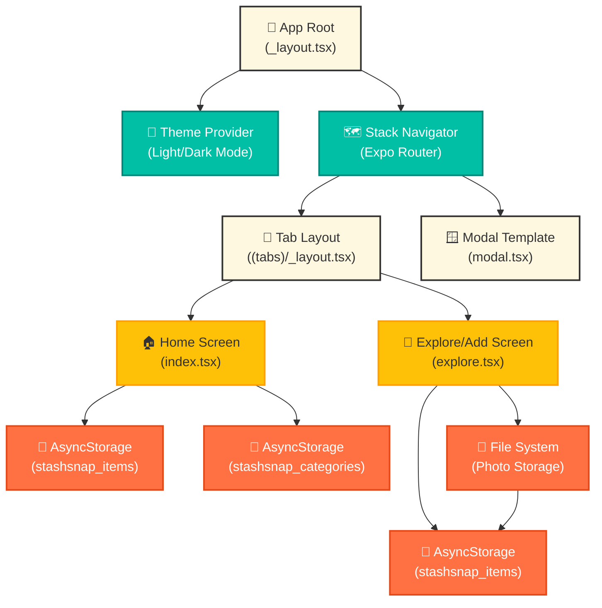

## 2. Component Hierarchy & Relationships

```mermaid
graph TD
    Root["App Root<br/>_layout.tsx"]

    Root --> ThemeProvider["ThemeProvider"]
    Root --> StatusBar["StatusBar"]
    Root --> ColorScheme["useColorScheme Hook"]

    ThemeProvider --> StackNav["Stack Navigator<br/>Expo Router"]

    StackNav --> TabNav["TabsNavigator<br/>((tabs)/_layout.tsx)"]
    StackNav --> ModalScreen["Modal Screen<br/>modal.tsx"]

    TabNav --> HomeScreen["🏠 Home Screen<br/>index.tsx"]
    TabNav --> ExploreScreen["📸 Explore Screen<br/>explore.tsx"]

    HomeScreen --> HSComponents["Components:<br/>HapticTab, IconSymbol<br/>SafeAreaView, Header<br/>StatsCard, CategoriesSection<br/>ItemsList, Modal, FAB"]

    ExploreScreen --> ESComponents["Components:<br/>PhotoSection, CameraControl<br/>GalleryControl, FormInputs<br/>ActionButtons, FileSystem"]

    HSComponents --> StateHS["State:<br/>items[], selectedCategory<br/>categories[], selectedItem<br/>isEditMode, showLanding<br/>editTitle, editLocation<br/>editCategory, editValue"]

    ESComponents --> StateES["State:<br/>photo (URI)<br/>title, category<br/>location, value<br/>loading, error"]

    StateHS --> AsyncStorageH["AsyncStorage Operations:<br/>getItem: items, categories<br/>setItem: items, categories<br/>removeItem: item_id"]

    StateES --> FileSystemOps["File System Operations:<br/>copyAsync: save photo<br/>documentDirectory<br/>stashsnap_photos/"]

    FileSystemOps --> AsyncStorageE["AsyncStorage Operations:<br/>setItem: new item<br/>reference photo URI"]

    AsyncStorageH --> DataModel["Data Model:<br/>Item, Category<br/>interfaces"]
    AsyncStorageE --> DataModel

    ColorScheme --> Theme["Theme System:<br/>Light/Dark<br/>Constants/theme.ts"]

    theme primary
    class Root primary
    class StackNav primary
    class TabNav primary
    class HomeScreen action
    class ExploreScreen action
    class HSComponents secondary
    class ESComponents secondary
    class AsyncStorageH secondary
    class AsyncStorageE secondary
```

## 3. Data Flow Architecture

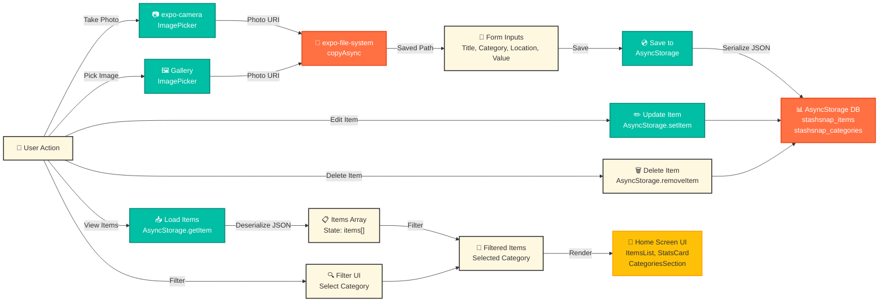

## 4. State Management & Storage

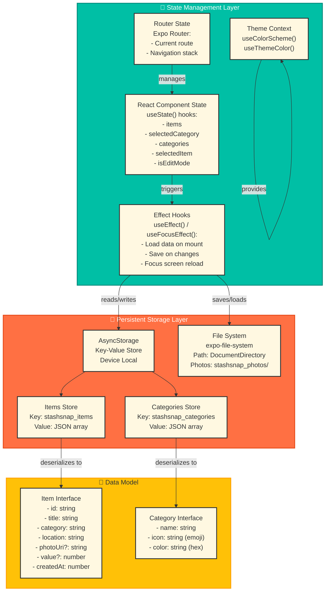

## 5. Screen & Navigation Flow

```mermaid
graph TD
    Launch["🚀 App Launch"]

    Launch --> RootLayout["Root Layout<br/>(_layout.tsx)"]

    RootLayout --> ThemeCheck{"Device Theme<br/>Setting"}

    ThemeCheck -->|Light| LightTheme["Light Mode<br/>Theme Applied"]
    ThemeCheck -->|Dark| DarkTheme["Dark Mode<br/>Theme Applied"]

    LightTheme --> TabsLayout["Tab Navigation Layout"]
    DarkTheme --> TabsLayout

    TabsLayout --> DefaultTab["Default: Home Screen<br/>(tabs/index.tsx)"]
    TabsLayout --> TabBar["Bottom Tab Bar<br/>Home | Explore"]

    DefaultTab --> HomeUI["Home Screen UI"]

    HomeUI --> LandingCheck{"First Visit?"}

    LandingCheck -->|Yes| Landing["Landing Page<br/>- Hero Section<br/>- Features<br/>- CTA Buttons"]
    LandingCheck -->|No| ItemsList["Items Display<br/>- Category Filter<br/>- Item Cards<br/>- Stats Card"]

    Landing -->|'Try App'| ItemsList
    Landing -->|'Skip'| ItemsList

    ItemsList --> Actions["User Actions:<br/>- View Item<br/>- Edit Item<br/>- Delete Item<br/>- Create Category<br/>- Delete Category"]

    TabBar -->|Tap Explore| ExploreScreen["Explore/Add Screen<br/>(tabs/explore.tsx)"]

    ExploreScreen --> AddUI["Add Item UI"]

    AddUI --> PhotoStep["Step 1: Photo<br/>- Camera<br/>- Gallery<br/>- Save to FS"]

    PhotoStep --> FormStep["Step 2: Details<br/>- Title input<br/>- Category select<br/>- Location input<br/>- Value input"]

    FormStep --> SaveStep["Step 3: Save<br/>- Validate input<br/>- Add to AsyncStorage<br/>- Navigate home"]

    SaveStep --> HomeUI

    Actions -->|Edit/Delete| UpdateUI["Update/Delete UI<br/>- Modal popup<br/>- Confirm action<br/>- Update AsyncStorage"]

    UpdateUI --> ItemsList

    classDef default fill:#FFF8E1,stroke:#333,stroke-width:2px,color:#333;
    classDef primary fill:#00BFA5,stroke:#00897B,stroke-width:2px,color:#fff;
    classDef secondary fill:#FF7043,stroke:#E64A19,stroke-width:2px,color:#fff;
    classDef action fill:#FFC107,stroke:#FFA000,stroke-width:2px,color:#333;

    class Launch primary
    class RootLayout primary
    class TabsLayout primary
    class HomeUI action
    class ExploreScreen action
    class SaveStep action
    class ItemsList action
```

## 6. Component Architecture Map

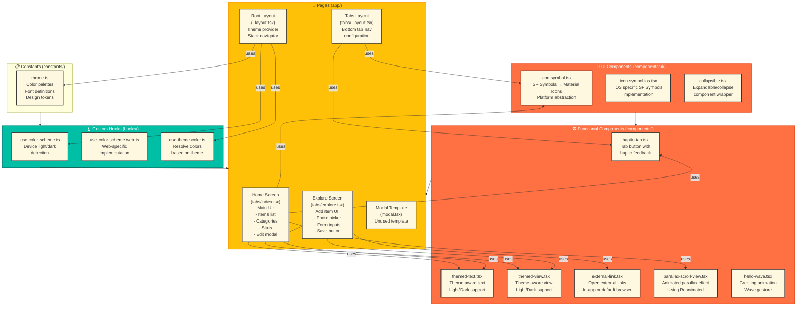

## 7. Technology Stack & Dependencies

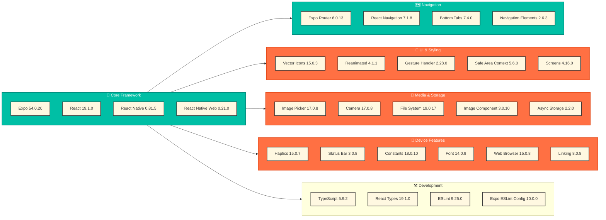

## 8. File Structure Hierarchy

```
stashsnap/
├── 📱 app/                    [Expo Router Pages & Routes]
│   ├── _layout.tsx            Root layout with theme & navigation
│   ├── modal.tsx              Modal template (unused)
│   └── (tabs)/                Tab-based navigation group
│       ├── _layout.tsx        Tab navigator configuration
│       ├── index.tsx          Home screen
│       └── explore.tsx        Add item screen
│
├── 🎨 components/             [Reusable UI Components]
│   ├── ui/
│   │   ├── icon-symbol.tsx    Icon abstraction layer
│   │   ├── icon-symbol.ios.tsx iOS icon implementation
│   │   └── collapsible.tsx    Collapsible component
│   ├── haptic-tab.tsx         Tab button with haptics
│   ├── themed-text.tsx        Theme-aware text
│   ├── themed-view.tsx        Theme-aware view
│   ├── external-link.tsx      External link handler
│   ├── parallax-scroll-view.tsx Animated scroll
│   └── hello-wave.tsx         Greeting animation
│
├── 🪝 hooks/                   [Custom React Hooks]
│   ├── use-color-scheme.ts    Color scheme detection
│   ├── use-color-scheme.web.ts Web color scheme
│   └── use-theme-color.ts     Theme color resolver
│
├── 📋 constants/               [App Constants]
│   └── theme.ts               Colors, fonts, design tokens
│
├── 🖼️ assets/                   [Static Assets]
│   ├── images/                App icons, splash screens
│   ├── icon.png               App icon
│   └── favicon.png            Web favicon
│
├── 🔧 scripts/                 [Build Scripts]
│   └── reset-project.js       Reset to template
│
├── 📄 Configuration Files
│   ├── package.json           Dependencies, scripts
│   ├── tsconfig.json          TypeScript configuration
│   ├── app.json               Expo app configuration
│   ├── expo-env.d.ts          Expo type definitions
│   ├── eslint.config.js       ESLint rules
│   └── .gitignore             Git ignore rules
│
├── 🔌 Expo Configuration
│   └── .expo/                 Expo build & cache
│
├── 📚 research/               [Documentation]
│   └── architecture.md        This file
│
├── 💻 IDE Configuration
│   ├── .vscode/               VS Code settings
│   └── .claude/               Claude AI settings
│
└── 📊 Version Control
    └── .git/                  Git repository
```

## 9. Data Models

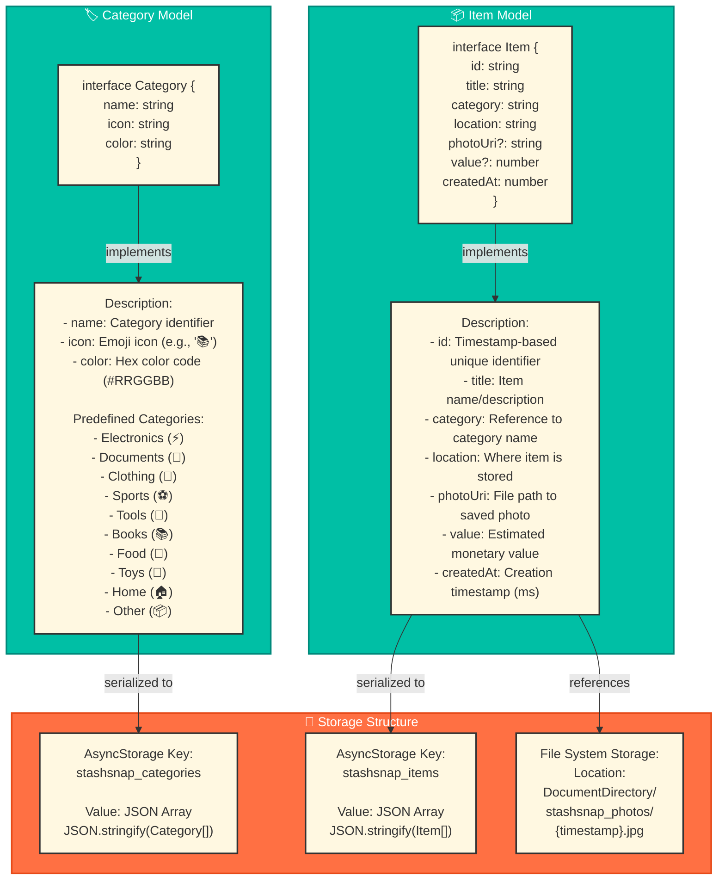

## 10. API & Storage Operations

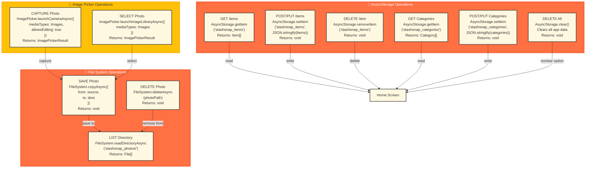

## 11. Theme System

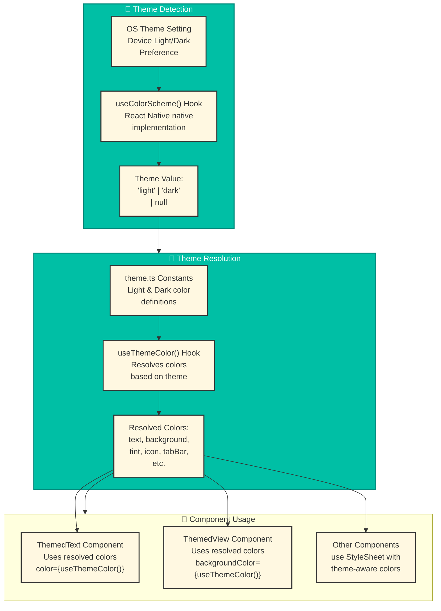

## 12. Build & Deployment Architecture

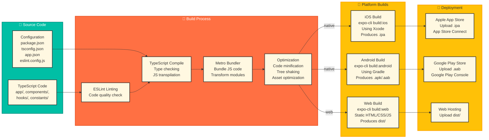

## 13. Key Features Flow

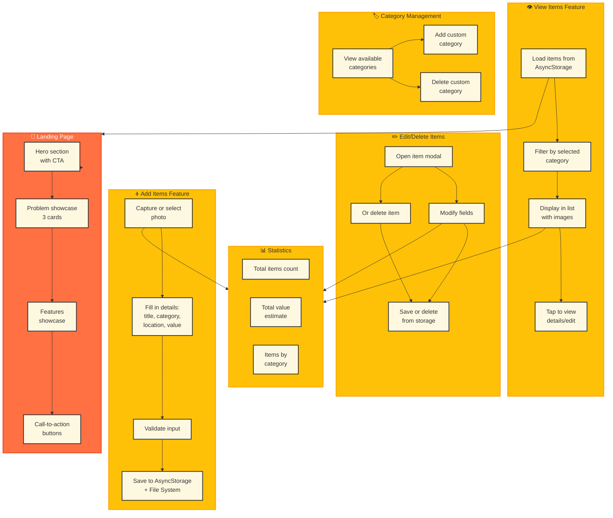

## 14. Development Workflow

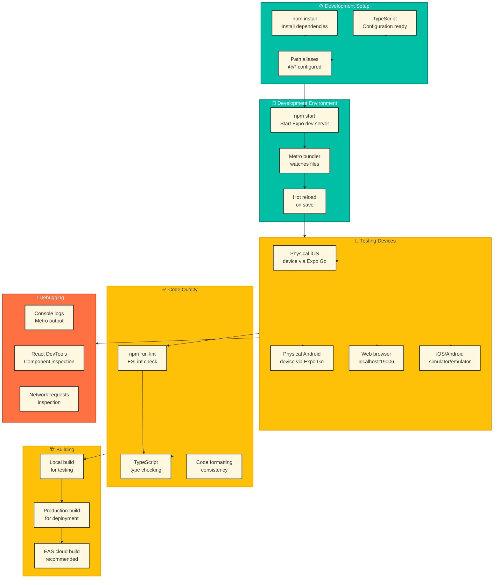

---

## Summary Table

| Aspect | Details |
|--------|---------|
| **Project Type** | Cross-platform mobile app (iOS/Android/Web) |
| **Framework Stack** | Expo + React Native + React |
| **Language** | TypeScript |
| **State Management** | React Hooks + AsyncStorage |
| **Navigation** | Expo Router (file-based routing) |
| **Backend** | None (fully client-side) |
| **Database** | AsyncStorage (local device storage) |
| **Authentication** | None |
| **Styling** | React Native StyleSheet + Theme system |
| **Animation** | React Native Reanimated + Gesture Animations |
| **Media** | Expo Image Picker + Camera + File System |
| **Testing** | Not configured |
| **Build System** | Expo EAS (cloud) or local Expo CLI |
| **Main Features** | Item catalog, photo capture, categorization, local storage, statistics |
| **Key Dependencies** | 30+ Expo & React Native modules |
| **Code Quality** | TypeScript strict mode + ESLint |
| **Entry Points** | iOS: Xcode, Android: Android Studio, Web: Browser |

---

## Key Architectural Principles

1. **Client-First Architecture**: All data stored locally on device
2. **Expo-First Approach**: Leverages Expo ecosystem for rapid development
3. **Theme-Aware Design**: Responsive to OS light/dark mode preferences
4. **File-Based Routing**: Expo Router for intuitive navigation structure
5. **Minimal Dependencies**: Focus on core Expo and React Native modules
6. **Cross-Platform Support**: Single codebase runs on iOS, Android, and Web
7. **Type Safety**: Full TypeScript implementation with strict mode
8. **Responsive UI**: Flexbox layouts that adapt to different screen sizes

---

**Generated:** 2026-01-20
**Document Version:** 1.0
**Architecture Analysis Tool:** Comprehensive Codebase Explorer
