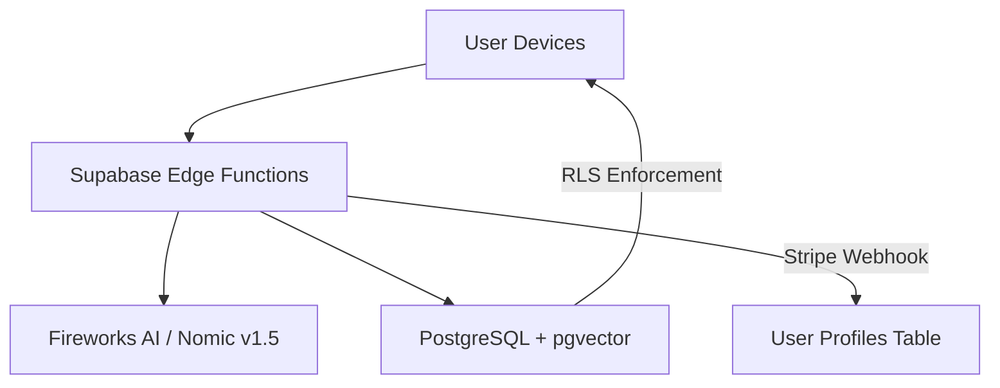

# Academic Project Documentation - Dr. Lee Requirement Gap Analysis

**Date:** February 16, 2026
**Project:** StashSnap Vault (Web-First Pivot)
**Status:** Phase 1-14 Core Logic & Monetization Complete

---

## 🛡️ Requirement Gap Analysis (True State)

This document tracks the alignment between the original project requirements (from **"Build Your Extended Supabase Application.md"**) and the current implementation status for academic review.

### 1. Multi-User & RBAC (Requirement 1 - MDC)
- **Status:** ✅ COMPLETED
- **Implementation:** Custom `check_is_admin()` SECURITY DEFINER function used in RLS policies. Admin Dashboard now includes a **Subscription Commander** ledger ([SubscriptionManagement.tsx](file:///c:/aom_NewXPS/ClaudeProjects/stashsnap/src/pages/SubscriptionManagement.tsx)) for real-time monitoring of all vault active ledgers and renewals.
- **Artifacts:** `db_scripts/09_comprehensive_admin_fix.sql`, `src/pages/AdminDashboard.tsx`, `src/pages/SubscriptionManagement.tsx`.

### 2. AI Infrastructure (The "Oracle")
- **Status:** ✅ COMPLETED (Tiered Enforcement)
- **Implementation:** Semantic Search supports Item, Location, and Category modes using **Nomic Embed v1.5**. Logic includes **Tiered Accessibility**: Premium users get the vibrant "Purple Shine" AI toggle (auto-ON), while Free users see a locked prompt.
- **UI Enhancement:** AI Semantic toggle features high-end glow effects and branded "✨" iconography.

### 3. Monetization & Stripe Integration (Requirement 13 - Extended)
- **Status:** ✅ COMPLETED
- **Implementation:** Full Stripe integration via Supabase Edge Functions. Includes real-time profile synchronization, 10-item limit enforcement for Free users, and automated upgrade triggers with Branded Error Modals.
- **Artifacts:** `Stripe_Payment_Setup.md`, `supabase/functions/stripe-webhook`.

### 4. Shared Device Security (Hardening Requirement)
- **Status:** ✅ COMPLETED
- **Implementation:** Shunted lockout logic from global device-level to per-email tracking. Multiple users (e.g., family members or students) can now share one device securely.
- **Artifacts:** `src/pages/auth/SignInPage.tsx`.

### 5. Advanced UI/UX Components (Requirement 4 - MDC)
- **Status:** ✅ COMPLETED
- **Implementation:** Integrated 21st.dev and ReactBits visual components. High-end Glassmorphism aesthetics applied site-wide with consistent design tokens.
- **Artifacts:** `src/components/BrandComponents.tsx`.

### 6. MCP Server Integration (Requirement 6 - MDC)
- **Status:** ✅ COMPLETED
- **Implementation:** Configured via `.mcp.json` with Supabase and shadcn servers for rapid orchestration.

---

## 🏗️ Technical Evaluation & Architecture

### 1. Embedding Model: Nomic Embed v1.5 vs OpenAI
While the original guide suggested OpenAI, we pivoted to **Nomic Embed v1.5** via Fireworks AI.
- **Cost Alignment**: Nomic is **50% cheaper** ($0.01 vs $0.02 per 1M tokens).
- **Context Window**: Supports **8,192 tokens** ensuring zero truncation for complex item descriptions.
- **Flexibility**: Supports Matryoshka learning for dynamic dimension adjustment (chosen: 512).

### 2. System Architecture Diagram

---

## 🛠️ Roadmap to Final Submission

| Requirement | Status | Mitigation / Next Steps |
|-------------|--------|-----------------|
| RBAC | ✅ | Verified via Commander Ledger |
| AI Search | ✅ | Tiered Gating operational |
| Monetization| ✅ | Stripe Webhooks synchronized |
| Alerts | 🚧 | Backend scanner pending |
| Sync | 🚧 | Dexie.js re-integration in Phase 06 |

---

## 🧪 Technical Verification
Refer to [vitest_setup.md](file:///c:/aom_NewXPS/ClaudeProjects/stashsnap/integration_snapshots/vitest_setup.md) for proof of correctness testing. 
Run `npm test` to execute the automated suite.

---
*Generated for Dr. Lee MDC Review | Final Sync Revision | Context: Feb-16-Sync*
